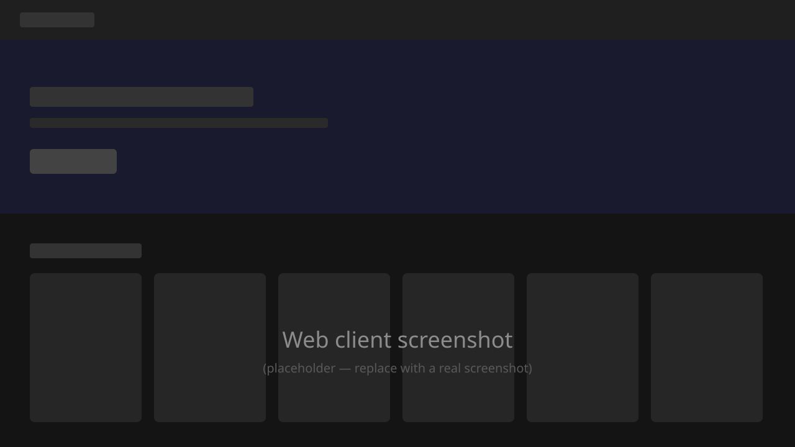
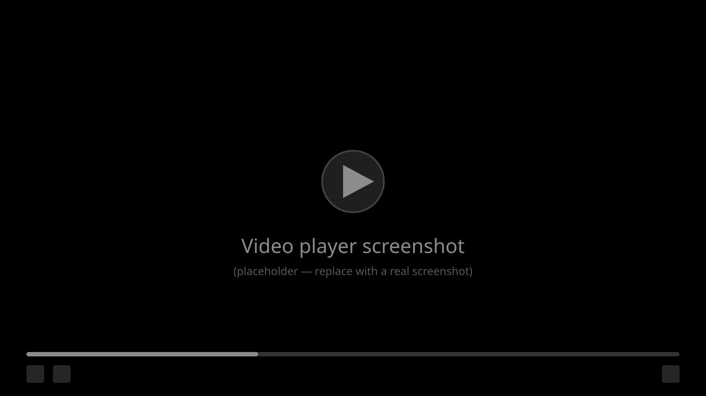
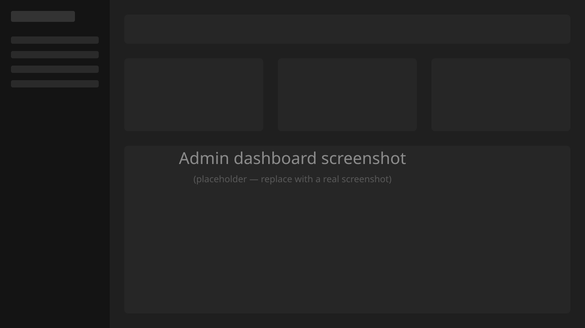
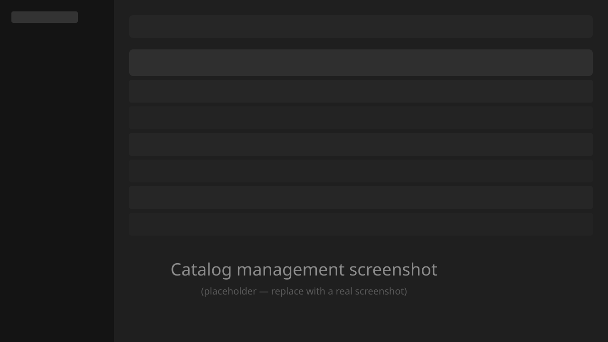

<div align="center">

# 🎬 FlixFlox UI

**Admin dashboard and web client for [FlixFlox](https://github.com/elvis-segovia/flixflox) — the self-hosted video streaming platform.**

Manage your catalog of movies and TV shows, and give your users a clean, Netflix-style viewing experience with HLS playback. Your media, your server, your rules.

[](LICENSE)
[](https://react.dev/)
[](https://www.typescriptlang.org/)
[](https://vitejs.dev/)
[](#running-with-docker)
[](CONTRIBUTING.md)

</div>

---

## Screenshots

<!-- TODO: replace the placeholder images in docs/screenshots/ with real screenshots -->

| Web client | Video player |
| :---: | :---: |
|  |  |

| Admin dashboard | Catalog management |
| :---: | :---: |
|  |  |

## Features

**For viewers** (`/`)
- 🍿 Netflix-style browsing for movies and TV series
- ▶️ HLS streaming with [video.js](https://videojs.com/), including episode playlists
- ⏭️ "Next episode" prompt near the end of an episode, with configurable offset
- ⏩ Skip-intro button with customizable message
- 👤 Viewer profiles

**For admins** (`/dashboard`)
- 🎞️ Full catalog management: movies and TV shows (add / edit / list)
- 🗂️ Categories and cast management
- 👥 User administration
- 🔐 JWT cookie authentication backed by the FlixFlox API
- 🌗 Ant Design 5 theming

## Quick start

> **Note:** this UI is a thin client for the [FlixFlox API](https://github.com/elvis-segovia/flixflox) — you need a running API instance first (see [Backend dependency](#backend-dependency)).

### Running with Docker

```bash
docker compose up --build
```

The multi-stage build produces the Vite bundle on `node:22-alpine` and serves the static output with `nginx:alpine` on port `80` (mapped to `5173` by Compose). The nginx config falls back to `index.html` so client-side routes survive a refresh.

Make sure `.env.production` points at a reachable FlixFlox API **before** building — values are inlined into the bundle at build time.

### Running locally (development)

Prerequisites: Node.js 22+, a running FlixFlox API instance.

```bash
cp .env.example .env.local
npm install
npm run dev
```

The dev server listens on `http://localhost:5173` and binds to `0.0.0.0`, so it is reachable from other devices on your network.

## Configuration

Environment variables are read at build time via Vite. Copy `.env.example` to `.env.local` and adjust:

| Variable                            | Default                  | Description                                         |
| ----------------------------------- | ------------------------ | --------------------------------------------------- |
| `VITE_STREAMAPI_URL`                | `http://localhost:5000`  | Base URL of the FlixFlox API                        |
| `VITE_STREAMAPI_PREFIX`             | `/v1/api`                | Public API prefix (matches FlixFlox routing)        |
| `VITE_STREAMAPI_PREFIX_ADMIN`       | `/dashboard`             | Path prefix for the admin dashboard routes          |
| `VITE_DEFAULT_NEXT_EPISODE_OFFSET`  | `15`                     | Seconds before episode end to surface "next episode"|

## Tech stack

- [React 18](https://react.dev/) + [TypeScript](https://www.typescriptlang.org/)
- [Vite](https://vitejs.dev/) for dev server and build
- [Ant Design 5](https://ant.design/) for UI components and theming
- [React Router 6](https://reactrouter.com/) for routing
- [video.js](https://videojs.com/) + `videojs-playlist` for HLS playback
- [axios](https://axios-http.com/) for API calls
- nginx (Alpine) for production serving

## Project layout

```
src/
  components/        Shared UI: auth, crud, menu, navbar, video player, theme
  pages/
    admin/           Dashboard pages (home, catalog, categories, cast, users, login)
    web/             Viewer-facing pages (home, movies, series, player, users)
  controllers/       API clients
  constants.tsx      Menu definitions and route metadata
  strings.ts         Localized labels
  App.tsx            Root: theme + menu wiring
  main.tsx           Entry point
config/default.conf  nginx config used in the production image
dockerfile           Multi-stage build (node build → nginx serve)
```

## Available scripts

| Script            | Purpose                                           |
| ----------------- | ------------------------------------------------- |
| `npm run dev`     | Vite dev server with HMR                          |
| `npm run build`   | Type-check (`tsc`) and produce a production build |
| `npm run lint`    | ESLint over `ts`/`tsx` sources                    |
| `npm run preview` | Serve the built `dist/` locally for verification  |
| `npm run debug`   | Vite dev server with `--debug` logging            |

## Routing

| Route          | What it serves                                              |
| -------------- | ----------------------------------------------------------- |
| `/`            | Web client: home, movies, series, player, viewer profiles   |
| `/dashboard/*` | Admin: home, catalog (list/add/edit), categories, cast, users |
| `/login`       | Authentication (JWT cookies set by the API)                 |

## Backend dependency

This UI does not work without a FlixFlox API. See the [FlixFlox README](https://github.com/elvis-segovia/flixflox) for instructions on running the API, MongoDB and the FFmpeg-backed conversion worker.

The CORS origin on the API must include the URL where this UI is served (defaults to `http://localhost:5173`).

## Contributing

Contributions are welcome! Bug reports, feature ideas, documentation and code — see [CONTRIBUTING.md](CONTRIBUTING.md) to get started. Issues labeled [`good first issue`](../../issues?q=is%3Aissue+is%3Aopen+label%3A%22good+first+issue%22) are a great entry point.

## License

[MIT](LICENSE) © Elvis Segovia
